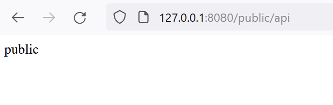
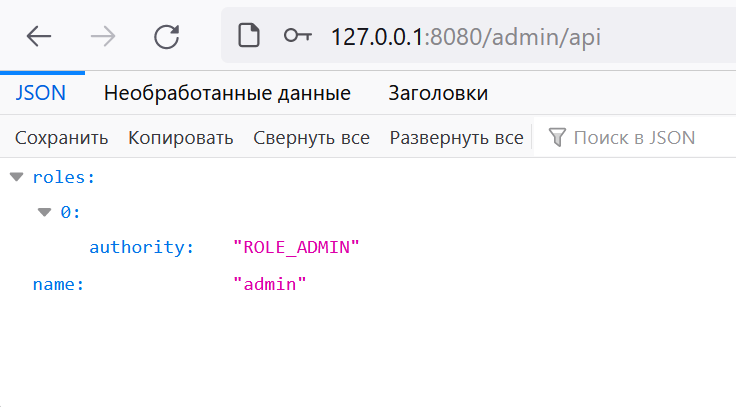
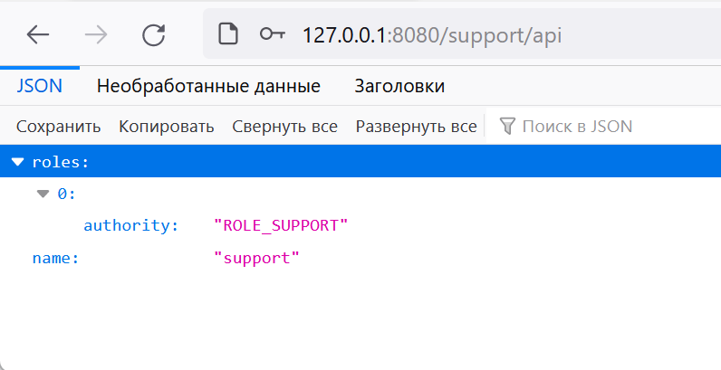

# java_skbCourse_hw10
## Spring security
#### Доступные адреса:
/login - авторизация
#### Доступные методы:
/public/api - доступен для любого пользователя + анонимно
/admin/api - доступен для пользователей с ролью ```ADMIN```
/support/api - доступен для пользователей с ролью ```SUPPORT```
#### Стандартные пользователи:
```admin:admin   support:support```
## Демонстрация работы


##### При авторизации под admin

##### При авторизации под support
